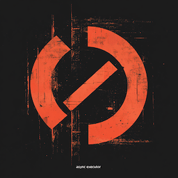

# some_executor

Rust made the terrible mistake of not having a batteries-included async executor.  And worse: there is
not even a standard trait (interface) that executors ought to implement.

The result is that libraries that want to be executor-agnostic and coded against 'some executor' are in a rough place.  Often they wind
up coding 'to [tokio](https://tokio.rs)' directly, which is a fine runtime but maybe downstream crates
wanted a different one.  Or, they can code to an interface like [agnostic](https://docs.rs/agnostic/latest/agnostic/index.html),
but that is suspiciously large and somehow depends on tokio, which motivates the 'lite version' [agnostic-lite](https://crates.io/crates/agnostic-lite),
which somehow still has 50 lines of features for tokio, smol, async-io, sleep, time, etc.

Anyway, this crate's one and *only* job is to define an obvious and minimal API trait (façade) that libraries can consume to
spawn their task on 'some' async executor.  Implementing that API for any given executor is trivial, however to keep the
crate small this exercise is left to that executor, a third-party crate consuming both APIs, or to the reader.

The crate implements both a trait suitable for generic code with zero-cost abstraction, and an object-safe trait suitable for
dynamic dispatch.

This crate also defines a 'global' executor, suitable for 'get' by library code and 'set' by application code.